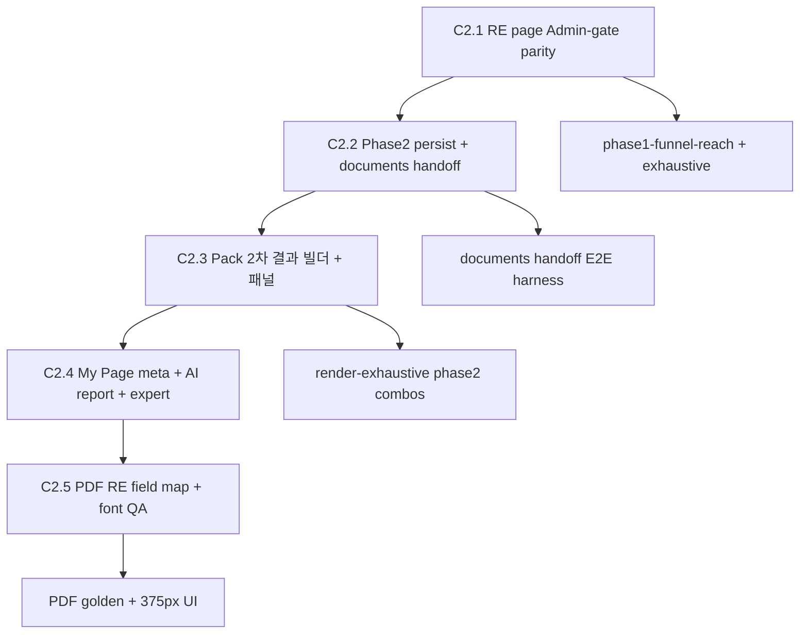

# C2 — 부동산 VERIFY 2차 이후 단계 연결 계획 (인벤토리 · 2026-10-07)

> 상태: **계획서만** (C2.0에서 커밋하지 않음). 1차 Clean Build 커밋(A) 완료 후 구현 미션 입력용.

## 요약

부동산 `/verify/real-estate`는 **Pack Bridge**로 Admin MASTER와 동일 **stitch UI**에서 **1차 질문 → 1차 간단 자료 → 가입 → 1차 Pack 결과**까지 연결됨.  
**「개인화 상세 검토하기」 이후**는 Admin `page.tsx`에 있는 **메타 persist · /documents phase2_upload · 2차 결과 · AI 보고서 · 전문가 · My Page/PDF** 체인이 **부동산 페이지에 미연결**이며, Pack **2차 결과 빌더·개인화 패널 데이터**도 없음.

---

## B-1) Admin MASTER 단계 × 파일 × 슬롯

| 단계 (Canonical Funnel) | Admin 주요 파일·API | 서비스 중립(슬롯/브리지) | 부동산 Pack 필요 내용 | 신규 슬롯(제안) |
|---|---|---|---|---|
| 1차 질문 (CASE/Q1+phase1) | `MasterReviewQuotationReport.tsx` (~2139–2320), `adminVerifyProfiling.ts` | Admin 하드코드 CASE | `generated/pack.ts`, `phase1Order`, `show_if` | — (Pack 노드) |
| 1차 간단 자료 | `AdminVerifyPhase2EvidencePanel.tsx` (`evidenceTier=phase1`) | `VerifyMasterEvidenceContentSlots` (`exampleTags`, `detailNoteByTier`, `footerNoteByTier`) | `phase1EvidenceChips.ts` / Pack 칩 문구 | RE phase1 tier copy (이미 chips) |
| 가입/리드 | `verify/admin/page.tsx` `insertMemberVerifyLead`, `RealEstateVerifyLeadCapture` 대응 | serviceType 분기 | `verify_real-estate`, `buildRealEstatePackMemberVerifyMeta` | — |
| 1차 종합 결과 | `AdminVerifyFirstResultPanel.tsx`, `buildAdminVerifyFirstResult` / Pack `buildFirstResultData` | `VerifyMasterFirstResultContentSlots` (title, intro, cautions subtitle, no-risk floor, paid CTA desc) | Pack m45·meta·judgment | `secondResult*` (2차용, 미정) |
| 개인화 상세 검토 CTA | `AdminVerifyFirstResultPanel.tsx` ~4450, `handleContinueClick` ~4422 | `paidDetailReviewDescription` | Pack transition hooks (`verifyPaidTransitionHooks`) | — |
| 2차 질문 | `MasterReviewQuotationReport.tsx` phase2 path (~2184–2256, 2236–2239 Pack) | Admin: `simulateAdminVerifyPhase2PathQuestionIds` | `phase2Order.ts`, F-path `generated/meta.ts` | — |
| 2차 상세 자료 (/documents) | `admin/page.tsx` `handleAdminVerifyPhase2DocumentsHandoff` ~1312–1336 → `/documents?mode=phase2_upload` | **아직 Admin 전용** (`service=verify_admin`) | Pack별 필수 서류 목록·예시 태그 | `phase2DocumentsChecklist?`, `documentsHandoffServiceKey?` |
| 2차 질문 완료 gate | `adminVerifyPhase2UploadComplete`, `ADMIN_PHASE2_DOCUMENTS_*` keys | Admin meta keys | 동일 meta 스키마 또는 RE 전용 prefix | persist 스키마 결정 (Ace) |
| 2차 종합 결과 | `buildAdminVerifyPersonalizedResult`, `isAdminVerifyPersonalizedResult` ~2694 | **Admin CASE 전용** — Pack 경로 **없음** | 2차 답+자료 합산 judgment·m45 | `buildPackPersonalizedResult` + slots |
| AI 보고서 / PDF | `admin/page.tsx` `handleAiReportRequest`, `recordAiReportRequestAndNotify`, `mypagePdfExecutiveRender.ts`, `api/mypage-pdf` | domain `admin` 분기 | RE 필드 매핑 (`adminVerifyMypageFields` 패턴) | PDF section labels RE Pack |
| 전문가 요청 | `handleExpertRequest`, expert meta | Admin handoff meta | RE caseId·answers flat | — |
| 재진입 Restore | `restoreVerifyLead.ts`, `?restore=1`, phase2 snapshot sessionStorage | `VERIFY_SERVICE_TYPE` | `loadVerifyMemberEntryState(verify_real-estate)` 부분만 | restore Pack answers + phase flags |
| CRM / lead meta | `persistAdminVerifyLeadMeta`, `buildAdminPhase2PersistMeta` | Admin 구조 | `real_estate_pack_v1` in member meta (있음) | phase2 persist parity |

**이미 중립화됨 (부동산 사용 중):** `verifyMasterPackBridge.ts`, `verifyMasterContentSlots.ts`, evidence/firstResult 슬롯, stitch progress `getPackVerifyStitchProgress`.

---

## B-2) 부동산 연결 상태 (코드 추적)

| 기능 | Admin (`verify/admin/page.tsx`) | 부동산 (`RealEstateVerifyMasterPage.tsx`) | 판정 |
|---|---|---|---|
| Pack bridge | — | `createRealEstateVerifyMasterPackBridge()` L50, `MasterFunnelLanding` L210 | **연결됨** |
| Phase1 evidence → signup | `onAdminVerifyPhase1Complete` L1818 | `handleAdminVerifyPhase1Complete` L167–178 | **연결됨** |
| Member handoff timeout | `awaitMemberVerifyLeadInsert` L97–112 | 동일 패턴 L124–135 | **연결됨** |
| `adminVerifyPhase2UploadComplete` | state + restore L1801 | **하드코드 `false` L215** | **끊김** |
| `onAdminVerifyMetaPersist` | L1819–1820 | **미전달** | **끊김** |
| `onAdminVerifyPhase2Complete` | L1821–1822 | **미전달** | **끊김** |
| `onAdminVerifyPhase2DocumentsHandoff` | L1823–1324 | **미전달** | **끊김** |
| `onAdminVerifyEnterPhase2` | L1825–1828 | **미전달** | **끊김** |
| 1차 결과 UI | `isAdminVerifyFirstResult` + Pack `buildFirstResult` (`MasterReviewQuotationReport.tsx` L4491–4492) | Pack layout → **Admin first result 플래그** (RE legacy `isRealEstateFirstResult` L2390–2394는 bridge 있을 때 false) | **1차 연결됨** |
| 「개인화 상세 검토」 클릭 | `handleContinueClick` L4422–4428 + 위 handlers | 로컬 `setAdminVerifyProfilePhase(2)`만 가능, **persist/handoff 없음** | **부분(UX만)** |
| 2차 질문 | Pack `buildReviewQuestions(..., 2)` L2236–2239 | 동일 컴포넌트 경로 | **UI 질문만** |
| 2차 /documents gate | `isAdminVerifyAwaitingPhase2Documents` L2327–2332 (Admin stitch only) | Pack: **gate 없음** (`packVerifyPhase2QuestionsComplete` L2335–2338, upload 불요) | **정책 불일치** |
| 2차 종합 결과 | `isAdminVerifyPersonalizedResult` L2694–2698 (**`isAdminVerifyStitchLayout` 필수**) | Pack 완료 후 **개인화 결과 플래그 false** | **끊김** |
| AI/전문가 CTA | L1829–1837 | **미전달** | **끊김** |
| Legacy RE profiling | — | `isRealEstateVerifyMasterLayout` = !bridge L2143–2147 | **의도적 비활성** (Pack만 사용) |

---

## B-3) 추적성·PDF·문장 생성 위험

### 같은 값 = 같은 의미 깨질 수 있는 지점

1. **Q1 `re_entry` vs CRM `real_estate_pack_case_id`** — `buildRealEstatePackMemberVerifyMeta` vs `resolveCaseFromAnswers` 불일치 시 CASE drift.
2. **Phase1 visible vs raw `phase1Order` 완료** — L-71 수정(`runner.ts` `visiblePhase1QuestionIds`); phase2에도 동일 패턴 필요.
3. **Admin meta keys vs Pack flat answers** — phase2 persist 시 Admin `ADMIN_PHASE2_*` 키를 RE에 재사용할지 전용할지.
4. **`optionLabel` vs PDF 필드** — My Page/PDF가 Admin CASE 라벨 테이블을 쓰면 RE 값 깨짐.
5. **1차 vs 2차 결과 헤드라인** — `firstResultVerdictFloor`는 1차만; 2차 합산 시 별도 Pack 규칙 필요.
6. **`/documents` 복귀 snapshot** — Admin `ADMIN_VERIFY_PHASE2_SNAPSHOT_STORAGE_KEY`; RE leadId·service 쿼리 미구현.

### PDF / pdf-lib (L-12)

| 위치 | 위험 |
|---|---|
| `src/lib/mypagePdfExecutiveRender.ts` | 한글 폰트 embed·줄바꿈; RE 문장 길이 증가 시 overflow |
| `src/lib/mypagePdfExecutiveMeasureFonts.ts` | 클라이언트 번들 유입 금지 (H-1) |
| `src/app/api/admin/case-pdf/route.ts` | Admin case 전용 필드 |
| `src/lib/adminVerifyMypageFields.ts` | RE Pack field id 미매핑 시 빈 PDF 섹션 |

### L-61~L-63 검사 필요 생성 지점

- `m45Engine.ts` / `buildResultMetrics` — phase1·2 metric footnote
- `resultBuilder.ts` / `sentencePolish.ts` / `renderDefectChecks.ts`
- `phase1VerdictBoost.ts`, `firstResultNoRiskFloor.ts`
- Pack personalized (미구현) — 2차 합성 문장
- `verifyPaidTransitionHooks.ts` — 유료 CTA 문구

---

## B-4) 구현 순서·QA (제안)

| 단계 | 작업 | QA |
|---|---|---|
| C2.1 | `RealEstateVerifyMasterPage`에 Admin 동등 gate props + leadId/resultToken + `persist*` (서비스 중립 helper 추출 권장) | phase1 reach 0; browser phase2 enter |
| C2.2 | `/documents?service=verify_real-estate&mode=phase2_upload` + restore; Pack phase2 evidence tier 슬롯 | handoff timeout·restore |
| C2.3 | `buildPackPersonalizedResult`, `isPackVerifyPersonalizedResult`, bridge hook | phase2 graph 전수 + render-exhaustive |
| C2.4 | `recordAiReportRequestAndNotify`, expert meta RE | mypage-data API spot |
| C2.5 | `adminVerifyMypageFields` RE branch or Pack export | pdf-lib measure server-only |

---

## B-5) Ace 결정 (정책·내용만)

1. **2차 /documents gate** — Pack 경로도 Admin과 동일하게 **8-slot documents 필수**인가, RE는 **간단 phase2 evidence 패널만**인가?  
   **권장:** Admin UI 100% 동일 → **동일 /documents gate** + Pack 체크리스트 슬롯.

2. **Phase2 persist meta 스키마** — Admin `buildAdminPhase2PersistMeta` 재사용 vs `real_estate_pack_phase2_v1`.  
   **권장:** answers flat 유지 + phase 플래그만 Admin 키 **호환 복제**(My Page 단일 리더).

3. **2차 결과 판정** — 1차 `firstResultVerdictFloor`를 2차에도 적용할지.  
   **권장:** 2차는 **합산 judgment만**; 1차 floor는 1차 화면 전용 유지.

4. **RE04/RE05 2차 F-path 미완 조합** — 일부 phase2 chain 빈 경우 UX.  
   **권장:** Pack 문서에 fallback chain 명시 후 exhaustive에 phase2 reach 추가.

5. **유료 CTA 실결제** — 현재 ○○○ 마스킹 유지; 클릭 시 동작은 Admin과 동일(상세 검토 플로우만).  
   **권장:** 결제 연동 없이 **플로우 parity**만 C2 범위.

---

## 참고 경로

- Pack 런타임: `src/lib/contentPacks/realEstate/`, `src/lib/verifyMasterPackBridge.ts`
- Admin MASTER: `src/app/verify/admin/page.tsx`, `src/lib/persistAdminVerifyLeadMeta.ts`
- 공유 UI: `src/components/cost-check/MasterReviewQuotationReport.tsx`, `AdminVerifyFirstResultPanel.tsx`
